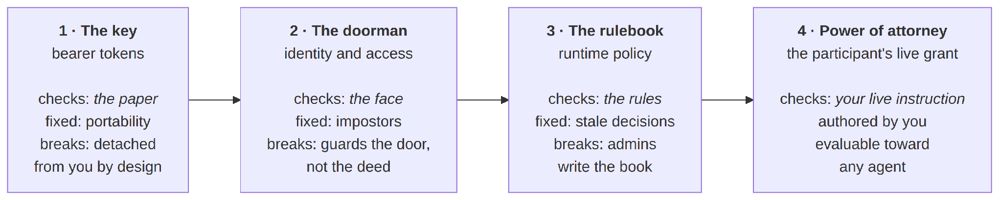
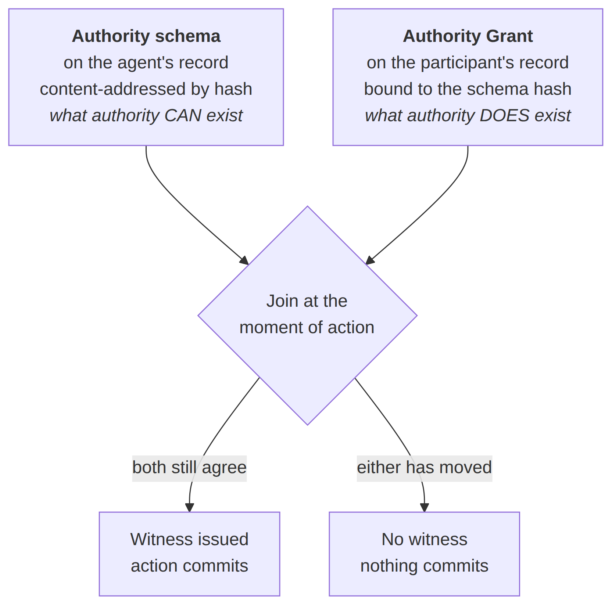
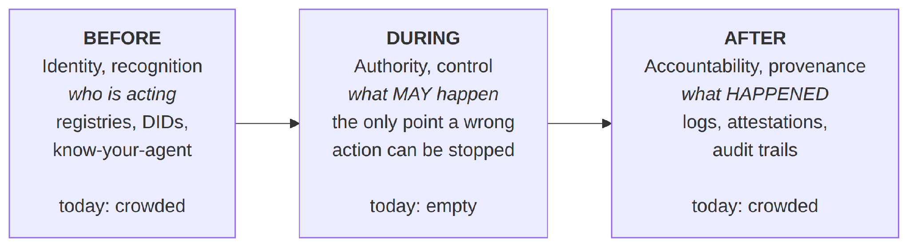

## What is the short answer?

Give the agent a scoped mandate rather than a credential, and put the enforcement outside the agent.

A mandate names the agent, states the class of action permitted, sets a ceiling, binds an instrument, sets an expiry, and remains revocable by you at any moment. The credential itself never leaves your control. What the agent carries is a witness that its action is valid against your current state, not a bearer of permission that works on its own.

The alternative, which is what most agent stacks do today, is to copy a credential into the agent and hope the agent behaves. That approach cannot be made safe by improving the agent, because the failure is architectural rather than behavioural.

Everything below explains why, and what the alternative looks like when it is engineered rather than described. The infrastructure referenced throughout is [MOI Network](https://blog.moi.technology/article/what-is-moi-network/), the Participant Layer that provides on-chain authority.

## Why is a credential not the same as authority?

Because a credential is information and authority is value, and those are two different mathematical categories.

The distinction is usually made loosely, in economic language. It can be made exactly. A category in which every object can be freely duplicated and freely discarded is the signature of information: a file, a number, a fact can be copied at no cost and dropped at no cost. A category in which objects cannot fork and cannot silently vanish is the signature of a linear resource, which is what value is.

Information is Cartesian. Value is linear.

Two well-known facts turn out to be the same statement in different fields. In quantum mechanics, the absence of a uniform copy operation is the no-cloning theorem. In value systems, illegal duplication of a unit is a double-spend. Formally these are one claim: the category is not Cartesian.

Now apply it to a token. An API key, an OAuth access token, a JWT and a bearer capability are each a snapshot, taken at issuance, of what you intended at that moment. Being information, they copy freely, cache freely and present freely. And therefore they go stale freely, because nothing binds the copy to the relation it describes.

Your actual authority behaves like value. It exists in exactly one place, it changes the instant you change it, and duplicating it makes the duplicate counterfeit rather than equivalent.

**Every system that puts the authority in the token has stored a linear thing in a copyable artifact.** Drift, revocation delay and accumulating permissions are not three separate bugs to be fixed independently. They are the copy operation applied to authority, three different ways.

Those keys leak at industrial scale, which is what the theory predicts. [GitGuardian’s State of Secrets Sprawl 2026](https://blog.gitguardian.com/the-state-of-secrets-sprawl-2026/) recorded 28.65 million new hardcoded secrets in public GitHub commits during 2025, a 34 percent rise year on year and 152 percent cumulative growth since 2021. Within that, [1,275,105 were AI-service secrets](https://www.gitguardian.com/state-of-secrets-sprawl-report-2026), up 81 percent, and 24,008 unique secrets appeared in Model Context Protocol configuration files alone, roughly 8.8 percent of them still valid at detection.

## What is the binding, and why does only it matter?

Because the claim that something is value is never a claim about its content.

This is the sharpest tool in the whole argument, and it resolves most confusion about what can and cannot be tokenised. Content is information: bytes, numbers, text. Content copies, by the theorem itself. What is linear is the **binding**: value is information bound to a participant in a context.

The illustration is worth carrying around. “The temperature in New York is 0 degrees” is information. Copy it and nothing is lost. “The temperature is 0 degrees and I am in New York and I am cold” is value. Strip the participant out and it does not survive as a smaller fact; it collapses back into weather data.

Run the same collapse in reverse and you have the reason a conventional substrate cannot hold value. It can store every byte of the content and still not hold the binding, because the binding is exactly the part that does not copy.

### Applied to the four kinds of value

Ordered by writer structure, meaning how many parties hold a pen over the state and on whose clock the pen moves, value forms four classes. In every one, the content copies and the binding does not.

| Class | Instances | Writer structure | Content that copies | Binding that does not |
|----|----|----|----|----|
| Owned | Money, tokens, native assets | One writer, one clock | The digits | The holding |
| Attested | Credentials, licenses, verifiable claims | Issuer signs once, holder holds | The document | The attestation relation |
| Contextual | Memory, preferences, trust history | Written by every interaction | The transcript | The live context |
| **Relational** | **Authority, mandates, delegation** | **Two writers, independent clocks** | Tokens about the grant | **The grant itself** |

Relational value is the maximal class. Every class below it has a home an ownership model can at least gesture at: a cell, an artifact, an owner. Relational value has none. Materialise the relation and some third party owns the intersection. Distribute it and one of its two writers loses their pen.

This is why authority is the hard case, and why the agentic economy hit it first. Every agentic workflow is a delegation, and every delegation is the two-writer relation.

## Where can an agent’s authority live?

There are only three places, and the choice determines everything that follows.

**Application-held.** The application holds a token issued on your behalf. This is OAuth, JWT and every sign-in-with flow. The application decides what to do with the grant, and the scope you agreed to is the scope for the life of the token. Your intent is represented, once, by someone else’s vocabulary of scopes.

**Agent-held.** The agent holds the credential or the configuration directly. This is a static API key in an environment file, secrets stored in an agent framework, or credentials passed to a tool server. Agent memory products sit here as context, though memory is not authority: a vector store can record that you prefer budget flights, and it cannot express that you authorised eight hundred dollars on one card until Friday.

**Participant-held.** You keep the authority. The agent receives a scoped mandate, and the network refuses to finalise anything outside it. This requires a substrate where the participant is a structural primitive rather than a field on a record, which is what [MOI Network](https://blog.moi.technology/article/what-is-moi-network/) provides as the Participant Layer. It is the only one of the three where a compromised agent does not become a compromised account.

The first two are where essentially all production agent authority lives today. The rest of this article is about why that placement fails at machine speed, and what the third looks like when it is engineered.

## What are the four generations of agent authority?

Agent authorization has been rebuilt four times. Each generation genuinely fixed its predecessor. Three of the four changed the artifact without changing the category.

*Figure 1. Four generations of agent authority. Each fixed its predecessor; only the fourth changes what is being checked.*

**Generation one, the key.** Bearer tokens: API keys, JWTs, OAuth-style credentials. What the verifier checks is possession. It fixed portability, because a key works anywhere, even offline. What still breaks: the key is detached from you by design, so a copy is as good as the original and both are stale from the moment they are minted. Any agent holding the key holds all of your authority, including helpers you have never heard of.

**Generation two, the doorman.** Identity and access management. What the verifier checks is the face: is this agent on the list. It fixed impostors, giving real names, real bans, and the ability to strike anyone off the roster. What still breaks: the doorman guards the door, not the deed. The list has no column for “800 dollars”; it was never about your intent. And only faces on the list exist, so a helper spawned mid-task either borrows the agent’s badge or stays out.

**Generation three, the guard with the rulebook.** Runtime policy engines. What the verifier checks is the rules: a fresh decision on every request, so nothing acts on stale information at decision time. It fixed the staleness of the *decision*. What still breaks is the authorship of the *book*. These are the organisation’s rules about the organisation’s agents, written by administrators, about kinds. The book cannot hold your pen, your terms or your counterparties. An agent born this morning is not in it and can act only as a kind, inheriting role-shaped power.

**Generation four, the power of attorney.** The participant’s live grant. What the verifier checks is your live instruction: authored by you, in your own terms, indexed to you, evaluable toward any agent including one that did not exist this morning, which receives a slice provably inside your bound rather than a copy of your power.

The pattern the ladder exposes is a single one. Paper, face and rules are all **content**: authored by someone other than you, indexed to someone else’s roster, copyable and therefore stale against you the moment you change your mind. Every generation asked content to do a person’s job. The fourth is not a better artifact. It is the first change of category: the check lands on the relation itself, and every artifact in the system is demoted to a witness of it.

Note what this does not displace. Recognition remains necessary, and the enterprise identity stack keeps its public contract unchanged. The identity layer authenticates who is acting. The authority layer holds what your live instruction permits. The fourth rung is an addition to the stack, not a replacement of the third.

## What is the Tuesday test?

One event separates the four generations. At 9:14 on a Tuesday, the principal changes 800 dollars to 500 dollars.

| Generation | What happens at 9:14 |
|----|----|
| The key | The key still says 800, to every door, until it expires |
| The doorman | Nothing to update. Her number was never on the list |
| The guard with the rulebook | She files a ticket. The book changes when an administrator edits it, eventually |
| The power of attorney | One edit. Every check everywhere, including agents spawned after the edit, sees 500. Nothing reissued, because nothing was ever copied |

If you take one diagnostic from this article, take that one. Ask any agent stack what happens at 9:14 on Tuesday. The answer tells you which rung it is on.

## What are the four failure modes of agentic authorization?

Four recur across every current approach, and all four are the same fact wearing different masks.

**Failure 1, authority drift.** A token issued at time T1 reflects your intent at T1. By T2 you may have changed your mind, but the token does not know. Bearer tokens, JWTs and OAuth scopes all suffer this. The verifier honours the token because it cannot tell the difference between a still-valid grant and a stale one.

**Failure 2, revocation latency.** When you revoke, the revocation has to propagate to every system that might honour the token. Revocation lists, short time-to-live values and gossip protocols all narrow the window without closing it. The designer must choose short TTLs and high friction, or long TTLs and long revocation windows. There is no clean exit.

**Failure 3, accumulating capability.** Bearer capability systems let agents accumulate authority over time and combine it in ways you never explicitly approved. The resulting authority surface is computable but not human-auditable.

**Failure 4, opaque sub-delegation.** When an agent invokes a subagent, you often lose visibility. Either the subagent inherits ambient authority, which is bad, or it requires explicit per-invocation consent from you, which is impractical, or the system invents a delegation hierarchy you cannot verify, which is worst.

### The same week, on today’s stack

Take a concrete mandate: book the cheapest Delhi to London flight, under 800 dollars, pay with the Visa ending 6411, before Friday.

Monday, the agent gets an OAuth-style token scoped to travel and payments. Note what already went wrong: the scopes on offer are the provider’s, not yours. There is nowhere to say 800, nowhere to say Friday, nowhere to say which card. You over-grant on day one because the grain of consent is the scope, not the intent.

Tuesday, you lower the budget to 500. There is no enforceable place for that number to live. You can tell the bot, which is a prompt rather than a control. You can edit a setting in the vendor’s database, which is the application’s policy applied to you rather than yours applied to it. The tokens, which are what verifiers actually check, are unchanged.

Wednesday, you cancel entirely. You must find the revocation screen, trust the primary agent to un-grant its subagents, and wait out token lifetimes. The payment subagent’s cached token survives until its TTL expires.

Thursday, a booking goes through. The airline sees a valid token and honours it. It cannot ask whether this is within what you want today, because there is no bound to check; the bound was never representable.

Friday, you try to audit. The answer is scattered across four systems, each recording what it chose to, none recording *why* an action was permitted, nothing binding them together.

Net position: recognition without control, records without prevention, intent without an address.

## Why can’t ownership models fix this?

Because authority is a cell with two writers on independent clocks, and ownership models assume one writer per cell.

An ownership model has exactly one way to hold a composite-keyed, two-writer relation: materialise the intersection as a managed entity. That forced materialisation produces a trilemma in which each available structure sacrifices one of the three things authority actually requires.

| Approach | Parallelism | Agent-side consistency | Clean revocation |
|----|----|----|----|
| One shared object for the relation | **Lost.** Every participant of that agent writes the same object and serializes | Held | Held |
| Per-participant owned objects | Held | **Lost.** The agent cannot mutate its side across objects it does not own, so a schema change cannot propagate | Held |
| Bearer capabilities the agent holds | Held | Held | **Lost.** Revocation needs an indirection cell, which is itself a shared object |

Any two of the three. Never all three.

Worked against the same mandate: attempt one, a single shared mandate object for the travel agent, means your Tuesday budget change queues behind thousands of strangers’ bookings. Attempt two, one owned object per customer, means that when the agency upgrades its schema it cannot reach into objects it does not own, so the change cannot propagate without reintroducing a shared registry. Attempt three, a bearer capability you sign, is elegant until Wednesday’s cancellation, which the capability cannot honour without an indirection cell that is itself a shared object.

Three attempts, three sacrifices. This is not bad engineering. It is what a one-writer-per-cell substrate does to a two-writer relation.

You can try to approach the right shape with one object per party joined at runtime, but the join has to discover, coordinate and atomically snapshot the pair, and all three needs converge on a single shared registry that is consensus-bound and globally serializing. That registry is the materialised intersection returning in disguise, and it is not removable, because composing a many-to-many relation without a shared coordination point requires the participant to be a dimension of the substrate.

## Why does the revocation window get worse at machine speed?

Because the window is priced in actions, not in seconds.

Every bearer architecture has a revocation window: the interval between your change of mind and the last verifier’s knowledge of it. At human speed the window was tolerable, because a session’s worth of actions fit inside it.

The cost, though, is not measured in time. It is measured in actions, and the number of actions inside a window scales with agent throughput rather than with the window’s length.

> **Exposure inside the window = actions per second × window length**

Hold the TTL fixed and exposure grows linearly with actions per second. Shorten the TTL and re-issuance traffic grows instead, recreating the coordination cost the tokens existed to avoid, at every node of the fan-out tree.

**There is no setting of the dial at which a bearer window is safe at machine speed, because agents manufacture actions and the window prices in actions.**

### The orchestration problem makes it worse

The authorization stack in production today was built for a static topology: one human, one application, one session. Its unit of consent is the login. Its unit of authority is the scope. Its clock is the human’s.

Agentic systems have a different shape. An orchestrator receives a goal, decomposes it at runtime, and spawns subagents that did not exist when consent was given. Each needs not your full authority but a slice of it, narrower than the parent’s, for minutes rather than months, often across an organisational boundary where the verifier has never seen you.

The many-to-many relation stops being an edge case and becomes the default topology of every workflow.

Three coping patterns are observable in production agent systems, and each is a failure mode industrialised:

- **Key inheritance.** The orchestrator’s bearer credential is copied down the tree, because a subagent that did not exist at consent time has nothing else to present. Drift and accumulation become transitive. Your mental model of who can act for you is wrong within minutes of the first fan-out.

- **Transport without authority.** The emerging agent-to-agent protocol layer solves how agents find and address one another while explicitly deferring what an agent may do to the application layer. The deferral is honest, and it is precisely the empty middle.

- **Registry identity.** Agent registries and know-your-agent schemes give the fan-out tree names, which sharpens accountability and changes nothing about control.

Take a procurement example. A principal grants up to 52,000 dollars against one cost centre by the 30th. An orchestrator spawns three negotiator subagents at runtime, each holding a copy of the principal’s credential. On day two she tightens the bound to 45,000. Under bearer authority that change has nowhere enforceable to land, and every action honoured against the old figure between then and TTL expiry is exposure.

## What is participant-centric authority?

Participant-centric authority is the model where the human holds authority over their agents as a live relationship, and enforcement runs outside the agent on a layer no single application controls.

It is an emerging paradigm rather than any single vendor’s feature. Several lines of pressure converge on it at once: agents act at machine speed, orchestrators spawn subagents that did not exist at consent time, and the exposure inside a revocation window scales with actions rather than with seconds. What the shift requires is infrastructure where the participant is a structural primitive, which is what the Participant Layer provides.

Its core inversion is one sentence: **authority is a stateful relationship between a participant and an agent, not an information artifact embedded in a token.** Tokens are witnesses of valid state, not bearers of permission.

Three properties have to hold together, and dropping any one collapses the model back into credential-copying.

| Property | What it means | What breaks without it |
|----|----|----|
| Authority is stateful | The grant lives in the participant’s own context and is the truth | A stolen or stale token is indistinguishable from a live grant |
| Authority is always revocable | Withdrawal is one state change and reaches sub-delegated authority transitively | Revocation becomes a propagation problem with a window |
| Authority is evaluated per interaction | Every action is checked against the relation as it stands now | The system enforces consent-time intent, not current intent |

The practical test is one question. If the agent’s model is manipulated into attempting something outside its mandate, does the attempt reach the target system? Under generations one through three the answer is yes, because the credential works regardless of intent. Under generation four the attempt fails before it commits.

### Where does the human sit?

In the loop of authorship, never in the loop of enforcement.

Today’s stack forces a false choice: keep a human in the loop per action and forfeit the autonomy the agent was built for, or grant broad standing access once and forfeit the safety. Both losses come from confusing session-grained permission to enter with interaction-grained control over what may happen.

Splitting them dissolves the dilemma. Intent is authored once, at human speed, with bounds in your own language at consent time. Enforcement runs per interaction, at machine speed, with no human present and none needed, because your judgment is already in the bound values being evaluated.

That split, rather than a faster consent screen or a smarter approval dialog, is what lets delegated authority run at the speed of the agents exercising it.

## How does a composed relation actually work?

By keeping the two sides of the relation on two separately owned records and joining them at the moment of action.

*Figure 2. The composed relation. Validity is a join between two independently owned records, evaluated at the moment of action.*

The agent’s side, its declared schema, lives on the agent’s own record. Your side, the grant, lives on yours. An action’s witness is valid if and only if both still agree with what the witness was issued against. The relation is composed where the two records meet, evaluated, and never materialised as an entity a third party has to own.

The two break paths are scoped by ownership, and both scopings are correct:

- **A schema change is the agent’s.** The hash changes, so every grant bound to the old hash stops resolving at once and all participants re-authorise. That is precisely the blast radius a schema change should have.

- **A grant change is yours.** It touches exactly one agent-participant relationship and nothing else. Minimal blast radius.

Neither party holds a lever that reaches into state the other owns.

### The same week, composed

Return to the flight mandate. Monday, your answers become bound values committed to your record: under 800, that specific card, before Friday. Your intent now has an address.

The search subagent receives a delegated token that is search-only, provably a subset of the grant, and on the evidence chain by construction. Nothing copyable confers power.

Tuesday, the bound moves from 800 to 500. One state advance in your context. Nothing propagates because nothing needs to; from that instant every evaluation anywhere witnesses against 500.

Thursday, a 480 dollar fare is found. Evaluation permits, a witness bound to the current context version is issued, and payment executes under a delegated token provably inside 500 and that card. The airline verifies a witness of current state rather than a memory of Monday. A 799 dollar fare on Wednesday would have been denied at issuance, so there is nothing to roll back, because nothing happened.

Had you revoked on Wednesday instead: one revocation transition. Future witnesses denied at issuance, in-flight tokens stale by version at next presentation, subagent tokens revoked transitively. No screens to hunt, no TTL to wait out.

Friday’s audit reconstructs which grant authorized each action, which schema version and bound values were in force, which token carried which subagent’s hop, and which counterparty acknowledged. Not just what happened. Why it was permitted at the moment it happened.

The week is deliberately ordinary. No exotic adversary appears and no protocol is attacked. A person simply changes her mind twice, the way people do. On today’s stack each change of mind opens a window in which agents act on information about an intent that no longer exists. In the composed model there is no window, because there was never a copy.

## What does a scoped mandate have to express?

Most authorization systems can express identity and a permission scope. Very few express the full set of constraints an agent acting at machine speed needs.

| Constraint | Question it answers | OAuth 2.1 | Static API key | Agent memory layer | Participant-centric mandate |
|----|----|----|----|----|----|
| Principal binding | Who authorised this agent | Partially | No | No | Yes |
| Action scope | What class of action is permitted | Yes | No | No | Yes |
| Value ceiling | How much may it commit | No | No | No | Yes |
| Instrument binding | Which account or card may it draw on | No | No | No | Yes |
| Expiry | When does the authority lapse | At token lifetime | No | No | Yes |
| Read limits | How many times may it read a sensitive field | No | No | No | Yes |
| Immediate revocation | Can you withdraw authority now | Provider dependent | Only by rotation | Not applicable | Yes |
| Bounded sub-delegation | Can a spawned subagent get a provably narrower slice | No | No | No | Yes |

Of eight constraints, OAuth 2.1 expresses two cleanly, an API key expresses none, and a memory layer expresses none.

A mandate carrying all eight is the minimum before an agent is safe to let loose on anything that matters. The field-level structure of how MOI holds these is set out in [what MOI Network is](https://blog.moi.technology/article/what-is-moi-network/).

### Which artifact is the authority?

This is where most implementations go wrong, so it is worth isolating. In a correctly built participant-centric system there are four artifacts and only one of them is the authority.

| Artifact | Issued by | Lifetime | What it is |
|----|----|----|----|
| **Authority Grant** | **The participant** | **Until revoked** | **A stateful record, not a token. The authority itself.** |
| Action witness | The network | Single interaction | An ephemeral witness of valid state |
| Delegated token | The source agent | Single interaction | A subagent witness, provably a subset of the parent |
| Offline credential | The participant, signed | Explicit TTL | A bearer-style credential, opt-in only |

The grant cannot be lost or stolen because it is never transmitted. The tokens can be presented but are meaningless without resolution against the grant behind them.

Offline is the one place bearer semantics legitimately appear, and the honest treatment is to price and disclose the window rather than hide it: opt-in only, provably narrower than the source grant, time-boxed, single-window, and anything executed after a revocation you issued during that window flagged as such in your audit trail.

Every authorization system has a revocation-blind window. Most do not tell you about it.

## Why does prompt injection defeat every in-agent control?

Because the component enforcing the rule is the same component the attacker is manipulating.

A system prompt saying an agent must never transfer funds is text. The model reads it alongside the web page, the tool response, the email and the calendar invite the attacker controls. There is no privileged channel. A rule expressed as text competes with every other piece of text the model ingests, and the model resolves that competition probabilistically.

The measurements are not close. Role-confusion research posted to arXiv in February 2026 and accepted to ICML 2026 found that a chain-of-thought forgery technique reached [roughly 60 percent attack success on the StrongREJECT benchmark across six frontier models](https://arxiv.org/html/2603.12277v6), against 0 to 4 percent for standard jailbreak prompts. Against ReAct-style agents specifically, the same tool-channel injections succeeded 56 to 70 percent of the time, averaging around 61 percent, where standard tool injections succeeded 0 to 2 percent on most models.

These attacks are already in production data and they do not look like the textbook examples. A May 2026 measurement study of roughly [200,000 real-world resumes processed by a language-model screening system](https://arxiv.org/abs/2605.28999) found hidden prompt injections in about 1 percent of them, with more than 90 percent using no explicit ignore-previous-instructions wording at all.

Guardrail libraries, input filters and output classifiers raise the cost of an attack without changing its category. They are heuristics running inside the same trust boundary as the thing they guard.

Moving the check outside the agent changes the category. If authority is held by the participant and verified before an action commits, an injected agent can be persuaded to attempt anything and still finalise nothing outside its mandate. **The agent can attempt any action; only actions within the mandate’s scope will finalize.** The attack succeeds at the model layer and fails at the authority layer, which is the only place where failure is survivable.

## Doesn’t agent identity or an audit log solve this?

No, and understanding why clarifies what authority actually is.

Three distinct things get collapsed into the word authority, and pulling them apart is most of the work.

*Figure 3. Identity, authority and accountability. Today’s stack crowds both ends and leaves the middle empty.*

**Identity without authority is a well-recognised agent with unbounded power.** Knowing exactly which agent drained the account is not a control.

**Accountability without authority is a cryptographically perfect record of a harm that nothing prevented.** An audit log is archaeology. It answers what happened, after it happened.

Authority is the middle: pre-interaction control over what may happen, and the only one of the three that stops a wrong action before it occurs.

The field is building the bookends. Authority is the book.

Worth noting: when authority is built correctly, accountability arrives as a corollary rather than as a separate system. If every authority decision is itself a witnessed state transition, the audit trail *is* the data structure. It answers not just what happened but why it was permitted at the moment it happened, in verifiable form.

### And a policy engine?

A runtime policy decision point moves the artifact from the wire to the server. That fixes the staleness of the decision and inherits the category error at the new address, because the authority is still a one-writer artifact authored at administrative cadence, in which you appear as data rather than as a writer.

It also adds a failure the wire did not have: every enforcement point must be able to reach the decision point.

**A stateful decision about a static authority is not stateful authority.** The loop closes only when the stateful thing is the relation itself.

## What about agent memory layers?

Memory and authority are different classes of value, and solving the first does not touch the second.

Memory APIs give agents persistent recall across sessions. Browser extensions carry preferences between models. Connectivity protocols standardise how agents reach tools. These are real solutions to real problems, and they share a structural limitation: they are anchored to the application rather than to you. If the memory provider shuts down, your agent’s memory of you is gone.

Stateless memory works for preferences. It fails the moment agents need to act with authority.

| What agents need | Why memory layers cannot provide it |
|----|----|
| Delegated authority | A vector database can store “user prefers budget flights.” It cannot express “user authorizes 800 dollars, from this card, until Friday, revocable now.” Authority requires committed state, not cached recall. |
| Cross-boundary trust | Your travel agent negotiating with the airline’s booking agent, under scoped authority from you, across a trust boundary, with witnessed finality. No memory API contemplates this. |
| Finality | When an agent spends your money, was the action witnessed, committed and irreversible, or is it a log entry that could be rolled back or hallucinated? |
| Participant-specific authority | The same agent must behave completely differently depending on who it acts for. That derives from your context, not the agent’s config. |

Put plainly: **memory tells an agent what you prefer. Authority tells it what you authorized.** In the taxonomy above, memory is contextual value and authority is relational value, and relational is the class that sits a full rung higher in structural demand.

## Where are the standards going?

The specifications converged on this problem during 2026, and they divide along exactly the line drawn above.

| Specification | Status and date | What it establishes |
|----|----|----|
| [W3C Decentralized Identifiers v1.1](https://www.w3.org/TR/did-1.1/) | Candidate Recommendation Snapshot, 5 March 2026 | Syntax, data model and operations for decentralized identifiers |
| [IETF OAuth 2.1](https://datatracker.ietf.org/doc/html/draft-ietf-oauth-v2-1-15) | Internet-Draft, fifteenth revision, March 2026 | Consolidated authorization framework obsoleting RFC 6749 and 6750 |
| [MCP authorization specification](https://modelcontextprotocol.io/specification/2026-07-28/basic/authorization) | Published 28 July 2026 | Optional authorization; where supported over HTTP, MCP servers act as OAuth 2.1 resource servers |
| [KYA-OS Protocol Specification v1.0.0](https://www.01net.it/vouched-and-the-decentralized-identity-foundation-launch-kya-os-an-open-trust-layer-for-ai-agents/) | Vouched and the Decentralized Identity Foundation, 29 July 2026 | Know Your Agent identity using DIDs and Verifiable Credentials, across 3 conformance levels |

Every one of these answers who the agent is. None of them answers what the agent may commit, or how a human withdraws that permission mid-flight. That is the empty middle, and it is what participant-centric authority is for.

In April 2026, [a16z crypto argued](https://a16zcrypto.com/posts/article/5-ways-blockchains-help-ai-agents/) that the bottleneck for the agent economy is identity rather than intelligence, proposing a know-your-agent framework of cryptographically signed credentials linking an agent to its principal, permissions, constraints and reputation. That framework sharpens recognition. It does not change who holds the pen.

### Has the regulatory deadline moved?

Yes, and recently. The Digital Omnibus on AI, Regulation (EU) 2026/1744, entered into force on 27 July 2026 and deferred the [EU AI Act](https://artificialintelligenceact.eu/implementation-timeline/) high-risk obligations. Stand-alone Annex III systems now have until 2 December 2027, and AI embedded in regulated products until 2 August 2028. The Article 50 transparency obligations still applied from 2 August 2026, and the deadline for each Member State to have an AI regulatory sandbox operational moved to 2 August 2027.

Deferral is time to build the authority layer, not a reprieve from needing one.

## Which approach should you use?

| Your situation | Use | Why |
|----|----|----|
| Agent reads public data and takes no action | A narrowly scoped static key | Blast radius is close to zero |
| Agent acts inside one product you control | OAuth 2.1 with the tightest available scope | One provider’s revocation is sufficient when there is one provider |
| Agent acts across several systems on a user’s behalf | Participant-centric authority | Cross-system revocation is the requirement, and no single provider can deliver it |
| Agent commits value, spends, or handles credentials | Participant-centric authority | Value ceilings and instrument binding cannot be expressed any other way |
| An orchestrator spawns subagents at runtime | Participant-centric authority | A subagent that did not exist at consent time needs a provably narrower slice, not a copied key |
| You must answer why an action was permitted, not just that it happened | Participant-centric authority | The evidence trail is the state history rather than a log beside it |
| Participants sit under different regulatory regimes | Participant-centric authority | Validation anchored to the participant makes the compliance regime a property of the substrate rather than application data on top of it |

The first two rows are well served by existing infrastructure and there is no reason to change them. The rest are where the credential-copying model runs out.

[MOI Network](https://blog.moi.technology/article/what-is-moi-network/) is the Participant Layer that provides on-chain authority, and it is the infrastructure this shift requires. Agents registered on MOI carry a verifiable identity bound to the participant who authorised them, receive a scoped grant rather than a credential, and can be revoked in a single state change. The same substrate also carries owned, attested and contextual value, so authority is the first class it implements rather than the whole of what it does. MOI is currently live on DevNet, and MOI Agent Launchpad, the reference application, runs on it.

## Key takeaways, recap

- **A credential handed to an agent is information about your authority, not your authority.** Information copies; value does not; authority is value.

- **Only the binding is linear.** The content of a grant copies freely. What cannot copy is the fact that this participant authorized this agent, right now.

- **Agent authorization has been rebuilt four times,** and three of the four changed the artifact rather than the category. The check has to land on the relation, not on a document about it.

- **Apply the Tuesday test** to any stack you are evaluating: at 9:14 on Tuesday the bound changes from 800 to 500, and what happens next tells you which generation you are on.

- **Ownership models face a trilemma** and can hold only two of parallelism, agent-side consistency and clean revocation.

- **The revocation window is priced in actions,** so there is no TTL setting that is safe once agents are manufacturing actions faster than humans manufacture decisions.

- **Authority is the middle of the interaction.** Identity recognises, accountability records, and only authority prevents. Build the middle and the record arrives as a corollary.

The protocol implementation, its artifacts and the reference application are covered in [what MOI Network is](https://blog.moi.technology/article/what-is-moi-network/).
