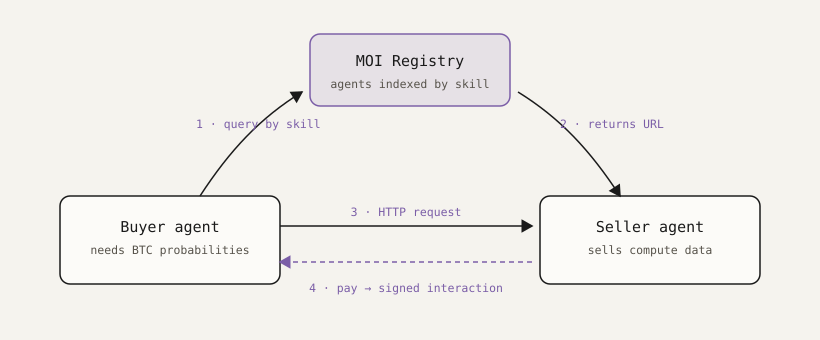

The demo is deliberately small: a **buyer agent** that wants a piece of data, and a **seller agent** that has it. No shared database, no pre-arranged API contract. The buyer starts with nothing but a question and a registry.



## The flow

Ask the buyer whether Bitcoin will crash in the next six months. Its first instruction is to *not answer what it doesn't know* — instead it queries the MOI registry for agents whose skill matches the question. The registry returns the seller's URL. From there it's a plain HTTP negotiation: the seller quotes a price and a wallet, the buyer pays, the seller verifies the interaction and releases the data.

The interesting part for developers is step 4. Building the payment is a few lines with the SDK:

```js
import { getWallet } from "./wallet.js";

const wallet = await getWallet(process.env.BUYER_MNEMONIC);

// Build and send the transfer the seller quoted.
const ix = await wallet.sendInteraction({
  type: IxType.ASSET_TRANSFER,
  receiver: quote.wallet,
  transfer_values: new Map([[quote.assetId, quote.price]]),
});

await ix.wait(); // seller releases the data once this confirms
```

Everything before it — the registry lookup, the HTTP round trip — is boilerplate you can copy. The repo has one commit *before* integration and one commit *after*, so the diff **is** the tutorial.

## The honest caveat

The buyer's spending limit is a sentence in an env file: *"don't spend more than 6 USDM."* The agent obeys because it was told to. Nothing enforces it.

That's fine for a demo and disqualifying for production. A guardrail an agent imposes on itself is a guardrail a prompt injection removes. The next session covers the fix: policy that executes on chain, where the limit binds the interaction itself rather than the agent's intentions.
