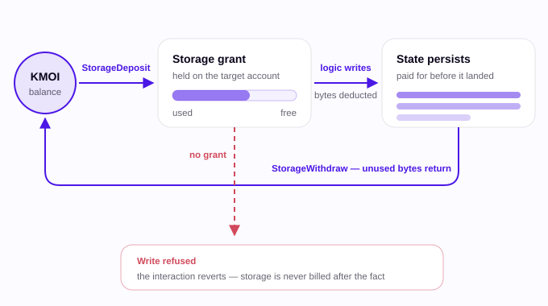
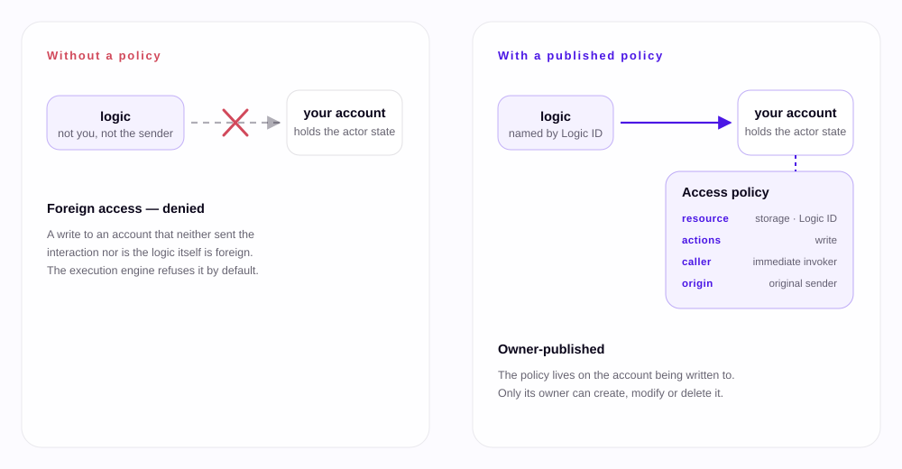

Two things became true on MOI in August 2026. State costs something, and it has an owner who decides who may write to it.

Both land in **go-moi v0.12.0**. go-moi is the reference implementation of the MOI protocol, the network where every participant, human or agent, holds their own state. Both changes run the full height of the stack: **PISA**, the runtime that executes logic; **Coco**, the language you write that logic in; and **js-moi-sdk**, the JavaScript SDK you call it from. This is one upgrade with a lot of moving parts, not a pile of separate ones.

Two things shipped in the same window on their own track. **Voyage**, the network explorer and faucet, moved to wallet sign-in and changed how the faucet works, and the **MOI wallet extension** shipped twice. Neither follows from storage costing or access control; they are covered separately below.

## What changed in this release?

Storage costing and access control. They shape most of what follows — though the account-level additions, and everything in Voyage and the wallet, ride along independently of both.

The versions this covers, all released between 12 and 18 August 2026:

`go-moi:v0.12.0` · `go-pisa:v0.8.0` · `cocolang:v0.9.0` · `vscode-coco:v0.4.0` ·
`js-moi-sdk:v0.8.0` · `js-moi-agent-registry:v0.3.0-rc1` · `voyage:v0.9.0` ·
`voyage-api:v0.9.0` · `voyage:v0.8.2` · `voyage-api:v0.8.2` ·
`moi-wallet-extension:v0.1.5` · `moi-wallet-extension:v0.1.4`

Storage costing and access control are related. Once a logic's state lives on *your* account rather than the logic's — which is what [the Participant Layer means in practice](https://blog.moi.technology/article/what-is-moi-network/) — two questions have to be answered explicitly that other chains answer implicitly. Who pays for the space that state occupies? And who is allowed to write into it?

| Layer | Storage costing | Access control |
|---|---|---|
| **go-moi** v0.12.0 | `StorageDeposit` / `StorageWithdraw` interactions, `moi.StorageMetric` and `moi.StoragePricing` RPCs | `AccessCreate` / `AccessUpdate` / `AccessDelete` interactions, `moi.AccessPolicy` and `moi.AccessPolicies` RPCs |
| **PISA** v0.8.0 | `VOLPAY` and `VOLRES` opcodes, metering per (account, payer) | The `AccessControl` hook go-moi's default-deny runs through |
| **Coco** v0.9.0 | `payer` clause on `mutate` | `grant storage_mutate` in Cocolab, `Actor()` queries |
| **js-moi-sdk** v0.8.0 | Deposit and withdraw, automatic funding on creation | Policy create, update and delete |

## How does paying for storage work?

You buy it up front as a **storage grant** — a quota of bytes reserved on a target account and attributed to a specific participant. It is not billed per interaction and it is not invoiced afterwards.

That distinction matters more than it sounds. **A write with no grant behind it is not deferred or charged later. It is refused, and the interaction reverts.** Storage is a precondition, not a bill.

Two operations manage the grant:

| Operation | Does |
|---|---|
| `StorageDeposit` | Converts KMOI into bytes of grant on a target account |
| `StorageWithdraw` | Releases unused bytes back into KMOI, returned to the sender |

A third piece, the `moi.StorageMetric` RPC, reports where a grant currently stands, and `moi.StoragePricing` gives the current rate. Inside PISA, `VOLPAY` charges a write against a grant and `VOLRES` reports what is left. `VOLRES` is a rename of `VOLAVL`, not a new opcode. From Coco, `Environment.StorageResult(account, payer)` replaces the removed `VolumeCapacity()`. A logic that frees state reclaims what it is no longer using, so cleaning up has a return rather than being pure altruism. One asymmetry to note: only grant attributed to the sender can be withdrawn, so depositing on someone else's behalf is a gift you cannot take back.

### Who pays when my logic writes?

By default, whoever sent the interaction. Coco v0.9.0 adds a `payer` clause on `mutate` that re-bills it:

```coco
mutate name -> MyModule.Logic.name payer Logic          // the logic absorbs its own setup cost
mutate cfg  -> MyModule.Logic.config payer Actor(sponsor)
```

`payer Sender` is the default; `payer Logic` makes the logic carry the cost; `payer Actor(<id>)` bills a named participant, who must have signed the interaction. It applies to logic state only.

**js-moi-sdk v0.8.0 funds newly created asset and logic accounts automatically**, with the amount tunable through `RoutineOption.storageFund` (1,000,000 KMOI by default). Read that narrowly: the bundled fund covers the new account's own creation cost, and nothing more. A deploy routine that also writes logic state still has to declare `payer Logic`, or have a `StorageDeposit` grant already in place. Beyond creation, `payer` is how you answer who pays — a logic that sponsors its own users, say.



## Why does a logic need permission to write my state?

Because on MOI it is writing to *your* account, not its own.

This is the part that differs most from what you may be used to. On Ethereum a contract owns its storage; changing your balance means changing the contract's own database, so authorization is implicit and any finer control is hand-written inside the contract with something like `require(msg.sender == owner)`.

MOI moves that state to the participant. The data a logic keeps about you — its **actor state** — lives on your account. So a logic routinely writes to storage it does not own, and implicit trust stops being a safe default. The protocol needs an explicit answer to: *may this logic write to this account, in this situation?*

The docs put it as a scheduling logic:

- Bob books his own time all day. He signs those interactions himself, and writing to his own account needs no extra permission.
- Bob's assistant Alice also arranges meetings for him. Now the logic must write to a calendar living on Bob's account, inside an interaction Bob never signed. That is a **foreign access**, and without a rule anyone could fill Bob's calendar.
- So before the write lands, the engine checks the policies published on Bob's account: has Bob authorised this logic, driven by Alice, to modify his state?

Alice's write goes through. The same write driven by anyone else is denied.

### What does a policy contain?

| Field | What it constrains |
|---|---|
| `Resource` | The class of object governed — `storage` today |
| `ResourceID` | The specific resource; for storage, the Logic ID doing the write |
| `Actions` | The operations permitted; at least one must be set |
| `Caller` | The immediate invoker — the sender, or the calling logic in a cross-logic call |
| `Origin` | The original sender of the interaction |
| `Scope` | Intended to narrow a policy to part of a resource — reserved, unenforced |

Caller and origin are each either unrestricted or a fixed set of participants and logics. Being able to constrain both is what lets Bob say *this logic, driven by Alice* rather than merely *this logic*.

You publish one with an `AccessCreate` interaction, amend it with `AccessUpdate` and remove it with `AccessDelete`. `moi.AccessPolicy` reads a single policy back and `moi.AccessPolicies` lists everything published on an account.

**One scope limit worth knowing.** The model defines resource types for assets, logics, storage and keys, but **only `storage` is enforced in this release** — a policy naming any other class is rejected at validation. `Scope` is reserved and unenforced too, so a policy cannot yet be narrowed to part of a resource. Write against what ships, not against the model.

Cocolab, the local lab you run Coco logic in, now emulates the runtime's default-deny, so a logic that quietly relied on writing other actors' state fails in the lab before it fails on the network:

```
grant storage_mutate to callers(any) origins(Alice) through Token as Bob
```

One caveat that matters: the lab only applies default-deny to projects targeting `[target.pisa] version = "0.8.0"`. A project still pinned to 0.7.1 keeps the old runtime, passes in the lab, and fails on the network. Bump the target before you trust the result.



## What else landed at the account level?

Three things worth knowing, none of which are storage or access control.

**Participant variants got first-class support.** `AccountInherit` lets a
variant account (a sub-account under a participant) inherit context from its
parent, and `AccountConfigure` is the separate interaction for adding and
revoking an account's keys.
`moi.SubAccountCount` reports how many variants sit under an account, and
participant-create is now correctly rejected when the target is itself a
variant. The syncer was optimised for inheritance too, so this is not a
surface-level addition.

**Asset holdings and approvals became inspectable.** Two read RPCs arrived for
things that previously had no direct query: `moi.Lockups` for asset lockups held
by an account, and `moi.Mandates` for asset approvals *and their expiry*. If you
have been tracking approvals by replaying interactions, you can now just ask.
Alongside them `moi.Registry` was renamed `moi.Deeds`: same `{asset_id,
asset_info}` shape, still the set of assets an account has created.

**Keys are enumerable.** `moi.AccountKeys` lists the keys on an account,
which multi-key and recovery flows previously had to infer.

## What do developers need to change?

Most application code keeps working. These are the things that do not.

- **Interaction op-codes were renumbered.** `IxOpType` is an integer on the wire and the values were reordered — **only `0`, `1` and `4` kept their meaning**. If you run an indexer, an explorer, or any custom client that decodes interactions by numeric op-code, it is silently wrong until updated. Five asset operations — transfer, approve, revoke, mint, burn — are folded into a single `IxAssetAction` with an endpoint and POLO-encoded calldata. `TxFuelSupply` is dropped, and `moi.Registry` is renamed `moi.Deeds`. The shape is unchanged, so this is a rename in your client rather than a removal.
- **Asset methods need exact state qualifiers.** Every asset write is `dynamic`, every asset read is `static`, and the compiler enforces it.
- **State naming caught up with the manifest — in js-moi-sdk.** `PersistentState` is now `LogicState`; `EphemeralState` is now `ActorState`. Coco itself has used `state logic` and `state actor` since v0.6.0, so this is an SDK-side rename.
- **Native asset standards have their own flows, also in js-moi-sdk.** Create MAS0, MAS1 and MAS2 through `MAS0AssetLogic.create()`, `MAS1AssetLogic.create()` and `MAS2AssetLogic.create()` — there is no bare `AssetLogic`. `AssetFactory` is now for custom MASX assets, and `AssetFactory.create()` requires a manifest.
- **A logic can no longer load another logic's actor state.** The runtime raises an error.
- **Return types changed** on `moi.LogicIDs`, `debug.Accounts` and `net.Peers` — they now return a unified identifier type, so parsers need updating.

- **An omitted state qualifier means `pure`, not `static`.** vscode-coco v0.4.0 now infers the qualifier a callable needs from its body and compares it to what you declared, so this surfaces as a warning rather than a surprise at runtime.

Smaller things that are simply nice. `deriveAssetId(sender, standard)` and `deriveLogicId(sender)`, from js-moi-identifiers, give you an account ID before it is created. Coco gained field-name shorthand in class literals (`Person{name, age}`).

vscode-coco v0.4.0 does more than understand the `payer` clause: it reads `[target.pisa] version` from the `coco.nut` beside the file you are editing and gates every version-dependent check on it. So it reports `VolumeCapacity()` as removed on a 0.8.0 target while still accepting it on 0.7.1.


## What do node operators need to do?

Upgrade every node together. This one does not roll.

Access control, storage costing and the new validator system object all change state-transition semantics, and access control adds interaction types that older nodes cannot decode. Mixed versions will diverge.

1. Stop all nodes. Do not roll.
2. Pull the `v0.12.0` image from the registry your deployment uses. Images are now published multi-OS and multi-arch.
3. Update config and genesis files for `ProtocolVersion 0.12.0`.
4. Deploy to every node. The build requirement is now Go 1.24.6.
5. Restart bootnodes, then guardian nodes.
6. Confirm peers connect on the `0.12.0` protocol IDs before resuming traffic.

What you will notice once it is running:

- Consensus and syncer traffic is now compressed, which shows up most on large ICS sets.
- A restarted node waits for initial sync to finish before joining consensus.
- Read locks let accounts take part in a tesseract with a latest-consistent-read guarantee instead of a full mutation, lightening the consensus hot path.
- Validator data lives in a dedicated system object, readable through `moi.Validators`, instead of being tracked ad hoc.
- The liveness algorithm is randomised, and a slot-locking stall is fixed.


## What changed in Voyage and the wallet?

Voyage shipped twice in this window, and the second release changes how you get in.

**Sign in with your wallet.** Voyage v0.9.0 replaces the old sign-in — generate a MOI ID, log in with IOME, or import an existing ID — with signing in through the MOI wallet Chrome extension. It works the way "Connect Wallet" does elsewhere: you sign a short message, **no transaction is sent and no fuel is spent**. You can connect more than one wallet account to a single Voyage account.

**Register yourself as a participant.** Since v0.8.2 you can complete on-chain registration from Voyage itself, by supplying either POLO-encoded account details or ordinary account details. The API side added rate limits on how many registrations and token transfers are allowed per day.

**Better history.** A new API returns a participant's tesseracts, the blocks of an account's own chain, with pagination, so Voyage pages through an account's history instead of pulling all of it in one unbounded response. Pending interactions appear on the home page again after a spell of going missing.

**The faucet changed, and this is the one that will catch people out.** It used to create an account and fund it in one step. Now it only sends tokens to accounts that already exist on the network. If the account is not on-chain yet the API returns `USER DOESNT EXIST`, which the Voyage UI catches and shows as a message about not being registered in the protocol — so recognise it by either form. Register first, then use the faucet.

**In the wallet itself**, two releases landed. v0.1.4 added a multi-account picker to the Connect Wallet screen — which is what makes connecting more than one account to Voyage possible — and a link for users to register their own wallet account. It also changed how addresses are truncated: the format is now `0x` plus the tag, then the first and last four characters of the fingerprint (`0x00…4cd9…da10`), with a suffix marking sub-accounts. Two ellipses, not a shorter string. The sign-interaction screen dropped sequence-number validation, and stopped overriding a `fuel_limit` the dapp supplied; fuel is still estimated when the dapp omits one. v0.1.5 followed with better error handling and validation in network configuration, and raised the participant registration amount in the encoded payload from 1k to 100k.

## Everything shipped

| Release | Released | What it brings |
|---|---|---|
| `go-moi:v0.12.0` | 14 Aug | Storage costing, access control, read locks, validator system object, native asset logics, message compression. Protocol version 0.12.0; Go 1.24.6 |
| `go-pisa:v0.8.0` | 13 Aug | `VOLPAY` and `VOLRES` opcodes, the `AccessControl` interface, metering per (account, payer), asset access levels |
| `cocolang:v0.9.0` | 14 Aug | `payer` on `mutate`, `Actor()` queries, field shorthand, `grant storage_mutate` in Cocolab, asset state qualifiers — [release notes](https://cocolang.dev/docs/releases/#v090) · [docs](https://cocolang.dev/docs/book) |
| `vscode-coco:v0.4.0` | 14 Aug | Coco 0.9.0 and PISA 0.8.0 support, the `payer` clause, actor validation — [changelog](https://github.com/sarvalabs/vscode-coco/blob/v0.4.0/CHANGELOG.md), and on the VS Code marketplace |
| `js-moi-sdk:v0.8.0` | 15 Aug | Storage and access-policy operations, automatic funding on creation, ID derivation, MAS0/1/2 flows, state renames — [release notes](https://github.com/sarvalabs/js-moi-sdk/releases/tag/v0.8.0) |
| `js-moi-agent-registry:v0.3.0-rc1` | 16 Aug | New registry Logic ID for the reset devnet, `SendOptions` for storage funding; pins `js-moi-sdk@0.8.0` as an exact peer dependency — [on npm](https://www.npmjs.com/package/js-moi-agent-registry) |
| `voyage:v0.9.0` · `voyage-api:v0.9.0` | 18 Aug | Wallet sign-in; faucet funds existing accounts only |
| `voyage:v0.8.2` · `voyage-api:v0.8.2` | 13 Aug | Participant registration with rate limits, tesseracts by participant with pagination, pending-interactions fix |
| `moi-wallet-extension:v0.1.5` · `v0.1.4` | 14 Aug · 12 Aug | Error handling in network config and a larger registration amount; and before it, the multi-account picker on Connect Wallet, a self-registration link, and a changed address-truncation format |

## What to do now

**If you build on MOI** — move to js-moi-sdk v0.8.0 and Coco v0.9.0. Rename `PersistentState` and `EphemeralState`. Add `dynamic` and `static` qualifiers to custom asset logic. If anything you own decodes interaction op-codes, fix the mapping *before* it touches a v0.12.0 node. If you use js-moi-agent-registry, move to v0.3.0-rc1 in the same step — it pins js-moi-sdk v0.8.0 exactly, so staying on v0.2.0 gives you an `ERESOLVE` conflict, and it carries the registry Logic ID for the reset devnet that older versions cannot find. Then run your logic in Cocolab under v0.9.0 — anything relying on a foreign actor-state write will fail there first, which is where you want to find it.

**If you run a node** — schedule a coordinated stop and follow the six steps above.

**If you use Voyage** — sign in with your wallet, and register as a participant before asking the faucet for anything.

For the ideas underneath all of this, the two places to start are [what MOI Network is](https://blog.moi.technology/article/what-is-moi-network/) and [how to give an agent authority without handing it your credentials](https://blog.moi.technology/article/how-to-give-an-ai-agent-authority-without-your-credentials/).
