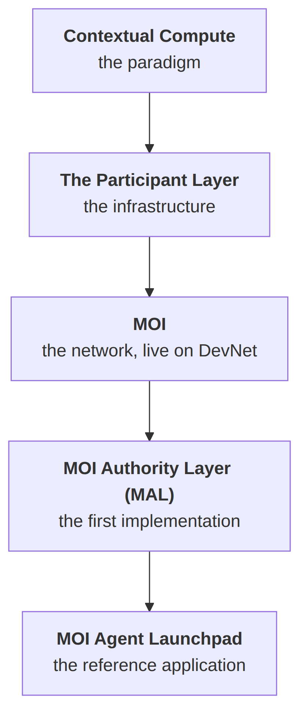
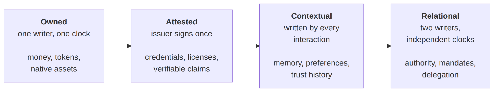
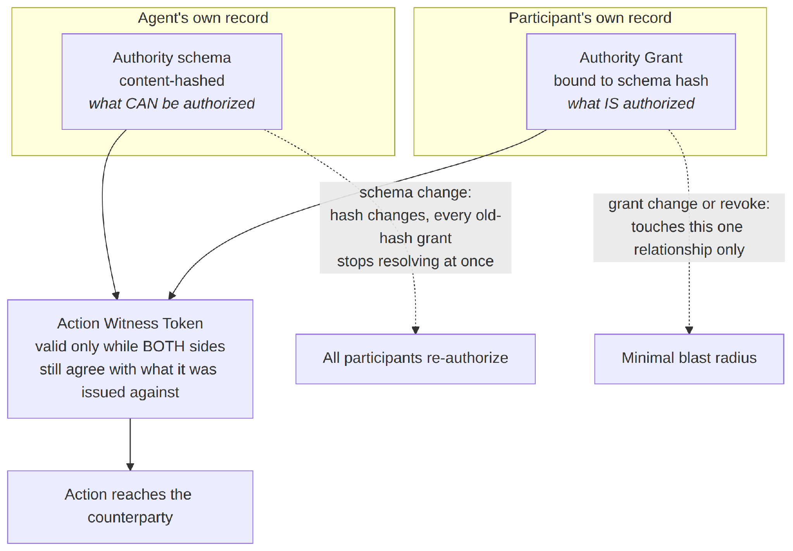
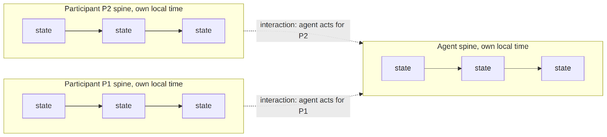
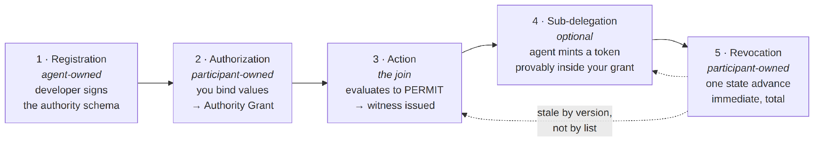
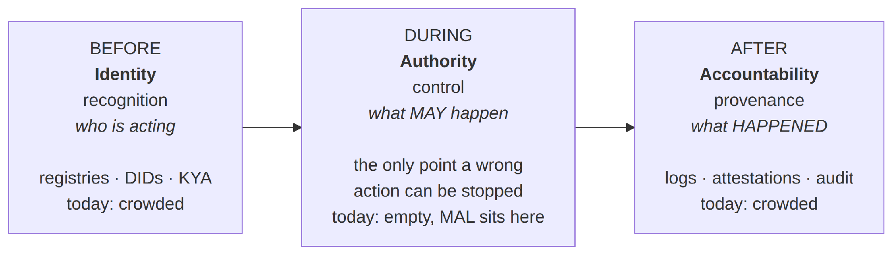

## What is MOI Network?

**MOI Network is the Participant Layer that provides on-chain authority.**

It is a base protocol in which participants exist natively in computation. State is owned by participants rather than held in a shared global table. Authority is scoped and anchored to the participant who granted it. Interactions are witnessed rather than globally reconciled. Context accumulates over time as a verifiable, portable structure that travels with the participant instead of being scattered across the applications they use.

MOI is built by Sarva Labs, based in Princeton, New Jersey. The founder, CEO and chief architect is Anantha Krishnan. The underlying mathematics is patented, and the work began seven years before the current agent wave made it urgent. **MOI is currently live on DevNet.**

The design follows a chain of reasoning rather than a list of features. A paradigm forces an infrastructure, the infrastructure is implemented as a network, and the first thing built on that network is the hardest thing the substrate has to hold.

*Figure 1. The MOI stack. Each rung is forced by the one above it rather than chosen.*

The rest of this page works down that chain: what the Participant Layer is, what it makes possible across several domains, what is missing in the systems it replaces, and why authority for AI agents is the problem it addresses first.

<!-- TODO: link the phrase "how to give an AI agent authority without handing it
     your credentials" below to Cornerstone 2 once that post is published. -->
If you are comparing approaches to agent authority rather than evaluating MOI specifically, how to give an AI agent authority without handing it your credentials sets the same argument against OAuth, JWT, capability tokens and runtime policy engines.

## What is the Participant Layer?

The Participant Layer is the computational substrate where participants exist natively: where state is owned, authority is scoped, interactions are witnessed, and context accumulates.

It sits beneath applications, alongside data infrastructure, and above raw compute, completing the stack with the dimension it has been missing.

| Dimension | Layer | What it provides |
|----|----|----|
| WHO | **Participant Layer** | Principal-of-record, scoped authority, live revocation, interaction-level accountability |
| WHAT | Application logic | Smart contracts, agent frameworks, enterprise applications, DeFi protocols |
| WHERE | Data and compute | Cloud infrastructure, data availability layers, storage, execution environments |

Applications keep doing what they do. Infrastructure keeps providing where they run. Large language models keep providing general intelligence. The Participant Layer provides who is acting, with what authority, witnessed by whom.

The applications remain. The trust model changes.

### What is a participant?

A participant is the fundamental unit of existence in this model: an entity capable of owning state, exercising authority and engaging in interactions. Individuals, agents and organisations are all participants. All value and authority anchor to one.

Two further primitives complete the set:

- **Interaction.** The fundamental operation. One or more participants engage to transform value within their respective contexts. Unlike transactions, which operate on anonymous global state, interactions operate on participant-scoped context.

- **Context.** The accumulated existence of a participant in computation. It emerges from interactions over time and encodes behaviour, preferences, permissions and authority. It is not data *about* the participant. It is what the participant becomes through computation.

Every computational paradigm is defined by a small set of irreducible primitives. The relational model has relation, tuple and attribute. Object orientation has object, class and method. Replicated state machines have account, transaction and block. This one has participant, interaction and context.

## What is Contextual Compute?

Contextual Compute is the paradigm underneath the Participant Layer. It introduces WHO as the fourth dimension of computation.

Computation has historically had three dimensions: WHAT provides logic and state transitions, WHERE provides storage and persistence, HOW provides execution and ordering. WHO, meaning participant, identity, ownership and agency, has been absent.

For seventy years that absence did not matter, because computation was a tool you used and then left. Nothing inside it belonged to you. That changed when computation became the substrate for money, identity, agency and delegated authority. When computation is where you live, you need to exist inside it, not as a row in a database and not as a profile in an app, but as a first-class primitive.

### Why does the distinction between information and value matter?

Because the machine we all use was built for one and is now mostly used for the other.

Information is copyable: duplicate a file and the original is unchanged. Information is observer-independent: the content of a message does not change based on who reads it. Information is reconcilable: if copies diverge, there is a fact of the matter to converge on.

Value has none of those properties. Your bank balance is not a file. Copy it to five servers and you do not have five times the money; you have one balance and four records about it.

| Property | Information | Value |
|----|----|----|
| Copying | Defined, duplicate freely | Undefined, duplication is counterfeiting |
| Observer | Independent, same for all | Constitutive, meaning depends on who |
| Reconciliation | Converge to ground truth | No ground truth without participants |
| State | Anonymous, global | Participant-indexed, contextual |

These are different mathematical categories. Information is Cartesian, meaning everything in it can be freely copied and freely discarded. Value is linear, meaning a resource flows along its wire and never forks or vanishes.

Two well-known facts turn out to be the same statement in different fields. In quantum systems, the absence of a uniform copy operation is the no-cloning theorem. In value systems, illegal duplication of a unit is a double-spend. Formally these are one claim: the category is not Cartesian.

### What exactly is the thing that cannot be copied?

Not the content. The binding.

**Value is information bound to a participant in a context. The content of the binding copies. The binding does not.**

The illustration is worth carrying around. “The temperature in New York is 0 degrees” is information; copy it and nothing is lost. “The temperature is 0 degrees and I am in New York and I am cold” is value; strip the participant out and it does not survive as a smaller fact, it collapses back into weather data.

Run the same collapse in reverse and you have the reason a conventional substrate cannot hold value: it can store every byte of the content and still not hold the binding, because the binding is exactly the part that does not copy.

## What are the four classes of value?

Value is not one thing. Ordered by writer structure, meaning how many parties hold a pen over the state and on whose clock the pen moves, value forms four classes. The Participant Layer is the substrate all four require.

*Figure 2. The four classes of value, in ascending order of structural demand. In every class the content copies and the binding does not; what ascends is how much structure the binding carries.*

| Class | Instances | Writer structure | Content that copies | Binding that does not |
|----|----|----|----|----|
| Owned | Money, tokens, native assets | One writer, one clock | The digits | The holding |
| Attested | Credentials, licenses, verifiable claims | Issuer signs once, holder holds | The document | The attestation relation |
| Contextual | Memory, preferences, trust history | Written by every interaction | The transcript | The live context |
| Relational | Authority, mandates, delegation | Two writers, independent clocks | Tokens about the grant | The grant itself |

Each class asks strictly more of the substrate than the one below it. Owned value needs a linear cell. Attested value needs that plus a live relation a verifier can reach. Contextual value needs the cell written by every interaction its participant has. Relational value needs all of that twice, under two pens that never coordinate.

That ordering produced MOI’s build order. A substrate that holds the relational class intact holds everything below it: freeze one writer after a single signature and attested value falls out, collapse the relation to one continuously written participant and contextual value falls out, reduce it to a quantity under one pen and owned value falls out.

Relational value is the maximal case, so MOI proved the substrate at its hardest point. The remaining classes are not deferred; they are pre-slotted, each developed at its own depth as an instantiation of the same taxonomy on the same substrate.

## What is the Context Superstate?

The Context Superstate is the cryptographic structure that holds a participant’s context: their state, relationships and permissions, as one verifiable, portable object.

It is not a wallet, and the difference matters. A wallet, if stolen, gives the thief everything. A home has rooms and locks, and you choose who enters which room. The Context Superstate is a home. The airline sees your passport during a booking interaction and never sees your balances. A trading application sees a balance during a swap and never sees your passport.

It is tamper-evident by construction, because it is a cryptographic commitment rather than a file on a server. Any modification invalidates the commitment and is rejected by the witness set.

Seven sub-contexts, one state, one participant:

| Sub-context | What it holds | Class of value |
|----|----|----|
| Assets | Native tokens, balances, metadata, with protocol-guaranteed conservation | Owned |
| Trust | Witness sets, delegation chains, scoped authority mandates | Relational |
| Storage | Participant-owned data, records, credentials | Where attested value anchors |
| Logic | Deployed code, interaction handlers, programmable rules | Not a value class |
| Keys | Cryptographic keys, rotation history, recovery paths | Not a value class |
| Preferences | Privacy policies, notification rules, interaction constraints | Contextual |
| Intelligence | Participant embeddings, interaction patterns, adaptation parameters | Contextual |

Read against the taxonomy, the Context Superstate is that census given an address. What looks like seven boxes in a diagram is really the four classes of value, each housed where its writer structure requires.

The blast-radius consequence is worth stating plainly. One breach of a centralised provider exposes everyone in it. When state is participant-indexed, the worst case is one participant, never millions.

## What does the Participant Layer make possible?

Four structural effects follow from modelling value correctly. They are the four classes of value seen from the outside.

| Effect | What it means |
|----|----|
| **Business trust** | Portable, verifiable trust anchored to participants rather than scattered across applications. Your compliance status and verification history live in your context, and services access them during interactions with permissions you define. |
| **Agent safety** | Delegated authority enforced at the infrastructure level rather than requested politely of the agent. |
| **Native assets** | Participant-owned value with safe tokenization and direct transfer, where assets stay with owners rather than sitting in a shared contract. |
| **Participant-specific intelligence** | Intelligence that emerges from a participant’s accumulated context, with referral knowledge from general-purpose models, rather than every inference searching the entire representational space from scratch. |

### Business trust

Trust today is scattered across applications. Each service maintains its own view of you. None are authoritative and all are stale. Renew a passport and you cannot even enumerate how many services hold the old number.

Anchor trust to the participant instead and the problem inverts. Your passport number lives in your Storage sub-context. Services do not store it; they access it during interactions, with permissions defined by your Preferences sub-context. Update once and every future interaction reads the current value. No broadcast, no stale copies, and nothing to leak because nothing was replicated.

Two people can hold genuinely different privacy policies over the same kind of data. One wants airlines to see a passport number while aggregators receive only a verified credential. Another wants biometric confirmation before any access, every time. Both policies live in the participant’s context and are enforced by the participant, not by thirty different service providers.

### Native assets

Smart contracts gave us programmable logic. You can write rules about value, but the value itself sits in the contract rather than with the participant. Contracts can enforce rules about value; they cannot express whose value it is. That requires WHO.

When assets are linear primitives inside a participant’s context, three things follow. Tokenized instruments carry compliance that travels with the participant rather than being bolted onto a contract. During an exchange, assets stay in the participant’s own context and the exchange logic never holds them, so the worst case when application code has a bug is a failed interaction rather than a drained pool. And aggregate liquidity becomes an emergent sum of participant-held positions rather than one contract holding billions.

### Participant-specific intelligence

Large language models maintain universal, participant-anonymous weights, so every inference searches the entire representational space and the millionth query costs what the first one did. Nothing was learned, adapted or personalised.

When a participant’s variables and relationships accumulate in their Intelligence sub-context, a small, dense, participant-specific intelligence emerges from that context with referral knowledge from general models. Mature participants become cheaper to serve while the intelligence itself becomes more valuable.

### Agent safety

This is the fourth effect and the one MOI built first, because the agent economy is the forcing function. The rest of this article is about it.

## What is missing in today’s systems?

Identity, trust, permissions and authority are each solved somewhere in the current stack, and none of them is solved where an autonomous agent actually needs it.

**Identity is well served and does not control anything.** Directories, single sign-on, decentralized identifiers, agent registries and know-your-agent schemes establish who is acting. Recognition at scale is genuinely useful. It is not a control. Knowing precisely which agent drained an account is not the same as having been able to stop it.

**Trust is fragmented across applications.** Each service holds its own partial, stale view of you and none is authoritative. Enterprise digitisation spends enormously on reconciliation, compliance checking and cross-platform verification, all of which is the system compensating for the fact that trust is not anchored anywhere.

**Permissions are session-grained, and agents are interaction-grained.** The unit of consent in today’s authorization stack is the login. Its unit of authority is the scope. Its clock is the human’s. Those were reasonable choices when one human used one application in one session.

**Authority lives in the wrong place.** When you connect an agent, you hand it an API key, an OAuth token or a JWT. Those are bearer instruments: the service on the receiving end validates the instrument, not the intent behind it. It cannot distinguish between you, your agent doing what you asked, your agent doing something you never asked for, and an attacker who read the key out of an environment file.

**Accountability arrives after the fact.** Logs, attestations and audit trails reconstruct what happened. Reconstruction is archaeology. A cryptographically perfect record of a harm that nothing prevented is still a harm.

The pattern across all five is the same. The current stack is well built at both ends of an interaction and empty in the middle, and the middle is the only place a wrong action can be stopped before it happens.

## Why does participant-centric authority matter now?

Because agents act at machine speed, and every authority model in production was designed for a human at a login screen.

Participant-centric authority is the shift from authority held by platforms and copied into agents, to authority held by the participant and enforced outside the agent. It is an emerging paradigm rather than a product feature, and several independent lines of pressure are converging on it at once.

### The topology changed

The authorization stack in production today was built for a static shape: one human, one application, one session. Agentic systems have a different shape entirely. An orchestrator receives a goal, decomposes it at runtime, and spawns subagents that did not exist when consent was given, each needing not your full authority but a slice of it, narrower than the parent’s, for minutes rather than months, often across a boundary where the verifier has never seen you.

A many-to-many relation between participants and agents stops being an edge case and becomes the default topology of every workflow.

### The four failure modes this produces

| Failure | What happens | Why it is structural |
|----|----|----|
| Authority drift | A token issued on Monday still reflects Monday’s intent on Thursday | The verifier cannot tell a still-valid grant from a stale one |
| Revocation latency | Revocation must propagate to every system that might honour the token | Short lifetimes narrow the window; nothing closes it |
| Accumulating capability | Agents accumulate authority over time and combine it in ways never explicitly approved | The resulting surface is computable but not human-auditable |
| Opaque sub-delegation | An agent invokes a subagent and the principal loses visibility | Either it inherits ambient authority, or consent per invocation, or an unverifiable hierarchy |

None of these is implementation sloppiness. Every one is the same fact wearing a different mask: the token carries the authority instead of witnessing it.

### The window gets worse rather than better

Every bearer architecture has a revocation window: the interval between your change of mind and the last verifier’s knowledge of it. At human speed the window was tolerable, because a session’s worth of actions fit inside it.

The cost is not measured in time. It is measured in actions, and the number of actions inside a window scales with agent throughput rather than with the window’s length.

> **Exposure inside the window = actions per second × window length**

Hold the token lifetime fixed and exposure grows linearly with actions per second. Shorten it and re-issuance traffic grows instead, recreating the coordination cost tokens existed to avoid, at every node of the fan-out tree. There is no setting of the dial at which a bearer window is safe at machine speed, because agents manufacture actions and the window prices in actions.

### Why authority has to be personal

Because the same agent has to behave completely differently depending on who it acts for.

Identical code, identical model. One participant may authorise an autonomous agent to spend a million dollars unattended. Another may cap the same agent at fifty dollars for groceries with confirmation required above thirty. The authority does not come from the agent. It comes from the participant.

There is nowhere in today’s stack for that to live. No agent framework provides a computational locus for participant-specific authority. No conventional chain stores participant-indexed state. The application cannot enforce it, because authority that is personal requires a person to exist inside the machine.

That is the gap the Participant Layer fills, and it is why participant-centric authority is the need of the hour rather than a preference.

### Where the human belongs

In the loop of authorship, never in the loop of enforcement.

Today’s systems force a false choice: approve every action and destroy the autonomy the agent existed for, or grant broad standing access once and destroy the safety. Both losses come from confusing session-grained permission to enter with interaction-grained control over what may happen.

Splitting them dissolves the dilemma. Intent is authored once, at human speed, in your own terms. Enforcement runs per interaction, at machine speed, with no human present and none needed, because your judgment is already sitting in the bound values being evaluated.

## How does MOI enable participant-centric authority?

By making the participant a dimension of the substrate, which is the one thing that lets the authority relation be composed rather than owned.

Start with what authority structurally is. Not a thing one party owns, but a many-to-many relation between an agent and a participant: *agent X may do Y on behalf of participant P*. It has a composite key and no single owner. Both sides change independently. The agent redefines what authority can exist, which should affect all its participants at once. Each participant grants, narrows or revokes their own authorisation, which should affect only them.

Systems that hold that relation as an object must break one of those properties. MOI holds it as a join.

*Figure 3. Authority as a two-context join. Neither party holds a lever that reaches into state the other owns.*

An action’s witness is valid if and only if the agent’s current schema hash and the participant’s current grant both still agree with what the witness was issued against. The relation is composed where the two records meet, evaluated, and never materialised as an entity some third party has to own.

The two break paths are scoped by ownership, and both scopings are correct. A schema change is the agent’s: the hash changes, every grant bound to the old hash stops resolving at once, and all participants re-authorise, which is precisely the blast radius a schema change should have. A grant change is yours: it touches exactly one agent-participant relationship and nothing else.

### Does the agent own anything?

No, and the distinction is between control and ownership rather than between owner and non-owner.

On MOI an agent is a participant in its own right, with its own record on the network. In MOI Agent Launchpad the agent is registered on chain and holds its own wallet. It still owns nothing of yours.

| What lives on the agent’s record | What lives on your record |
|----|----|
| The authority schema: everything this agent *could* ever be authorized to do | The Authority Grant: what this agent *is* authorized to do, for you specifically |
| Declared once by the developer, content-hashed, reusable across every participant | Established at consent time, unique to you, revocable by you alone |
| Signed by the developer’s key | Signed by you |

The agent declares a surface. You bind it. The surface is reusable, the binding is yours.

### Why does the network structure allow this?

Because state on MOI is laid out by participant in the first place.

MOI represents state as an MDAG, a Multi-link Composite Directed Acyclic Graph. Each participant has a vertical spine: their own history, one point per state transition, ordered in their own local time. When two participants interact, a point is appended to each spine and a horizontal link is drawn between them. The global structure is a set of independent spines, stitched together precisely and only where participants met.

*Figure 4. The MDAG. Vertical spines are participants’ own histories in their own local time; horizontal links are interactions. Spines that share no link are independent.*

Several properties fall out of the geometry rather than being engineered on top of it. Interactions between participants who share no link proceed in parallel as a matter of structure, not optimisation. The graph is acyclic, which means no feedback loop, which means re-entrancy is not prevented but unrepresentable. And because a decision resolves entirely within the contexts it concerns, it is final the moment those contexts agree.

That last point is what makes revocation instant. A revocation is final to its issuer immediately, because no third party’s agreement was ever part of what made the grant true.

### What about shared spaces?

A common objection is that participants interacting in the same venue must share state. The answer is the café.

Walking into a café is entering a shared context. There is a menu, a counter, a queue. It does not mean the patrons throw their wallets into a communal jar and queue to take their own money back out. Yet the communal jar is what a globally-ordered system does: the moment you interact in a shared venue, your balance becomes part of shared mutable state that every other participant’s transaction must be ordered against.

The correct decomposition is the one the café already uses. The venue’s own state belongs to the venue, which is itself a participant. Each patron’s own state stays theirs. And the one genuinely contended resource, the single cashier, is the only thing that needs a queue. A patron waits for the cashier, never to reach their own pocket.

The invariant that makes this hold is that inheriting a context grants participation in that frame and never a writable link back into your other contexts. All cross-context effects are explicit transfers.

## What is the MOI Authority Layer?

The MOI Authority Layer, MAL, is the trust enforcement architecture for agentic systems built on the Participant Layer. It is the first implementation of the relational class of value.

MAL answers four operational questions about every agent action: what is the agent permitted to do, who granted that permission, is the action within scope *at this moment*, and can it be revoked. Existing approaches answer one or two. MAL is designed to answer all four and produce cryptographic evidence for each answer.

Its core inversion is one sentence: **authority is a stateful relationship between a participant and an agent, not an information artifact embedded in a token.** Tokens are witnesses of valid state, not bearers of permission.

### The four design commitments

1.  **All authority is stateful.** Authority lives in the participant’s Trust sub-context, never in tokens.

2.  **Authority is always revocable.** Participants can revoke at any time, and revocation propagates instantly to all dependent capabilities including sub-delegated ones.

3.  **Offline action requires explicit, scoped, time-bound consent.** The system does not silently issue offline capability, and does not pretend an offline token is revocable when it is not.

4.  **Every action is reconstructable from evidence.** The log answers not just what happened but why it was permitted at the moment it happened.

### The five architectural principles

| Principle | What it means in practice |
|----|----|
| Authority is a relationship, not a credential | The grant is the truth. Credentials, tokens and signatures that reference it are derived artifacts. |
| Separate the surface from the binding | The developer declares once what the agent could ever do. Each participant binds their own version of it at consent time. |
| Deterministic enforcement, semantic interface | A language model helps you author intent in your own words. A language model never decides whether an action is permitted. |
| Witness, not bearer | Tokens prove an action is valid against current state at the moment of issuance. They are not transferable and have no value detached from the state they witness. |
| Disclosed offline | Offline capability is supported, opt-in, narrow, time-boxed, and the revocation-blind window is disclosed before you accept it. |

Principle three is the one people misread. The consent flow is language-model-mediated: MAL walks the agent’s schema and turns it into natural-language intent questions you answer in your own terms. The runtime authorisation decision is deterministic and formally verifiable. The model helps you write the rule. It never gets a vote on whether the rule was followed.

## What happens across the life of a grant?

Five stages, each a witnessed state transition on the record that owns it.

*Figure 5. The five-stage authority lifecycle. Revocation sweeps back by version, not by list.*

**Stage 1, agent registration.** The developer declares an authority schema: the entity types the agent operates on, the actions it can perform, and the context attributes those actions are constrained by. The schema is versioned, signed by the developer’s key and registered immutably in the agent’s own context. It declares which attributes you answer at consent time, which are fixed by the developer, and whether the agent supports offline capability and sub-delegation. Both default to no.

**Stage 2, participant authorization.** MAL walks the schema and generates a consent flow in natural language. Your answers become bound values which, together with the schema reference, form an Authority Grant in your context: schema reference, bound values, temporal bounds, sub-delegation flag, offline flag, your signature.

**Stage 3, action execution.** The agent prepares an action. MAL retrieves your grant, projects the relevant context state into the evaluation, and runs the surface evaluation. If it permits, MOI issues an Action Witness Token bound to the current context version, which the agent presents to the counterparty. The token is the receipt. The state transition is the authorization.

**Stage 4, sub-delegation.** Real agentic workflows involve agents invoking other agents that were never individually registered. If your grant permits it, the source agent mints a Delegated Action Token that is provably a strict subset of its bound authority: narrower scope, optionally narrower time, never broader. The delegated token joins the parent action’s evidence chain, so the hop is visible to you by construction.

**Stage 5, revocation.** You issue a revocation transition on your context. It is a single state advance and its effect is immediate and total. Future witnesses are denied at issuance. In-flight witnesses become invalid the moment they are presented to a verifier that consults MOI, because their context version is now stale. Delegated tokens inherit the revocation transitively.

There is no revocation list to propagate, no time-to-live to wait out and no cache to invalidate. **The act of revoking is the act of advancing the context.**

### A worked example

Asha tells her travel agent: book the cheapest Delhi to London flight, under 800 dollars, pay with the Visa ending 6411, before Friday.

On Monday that sentence becomes an Authority Grant on her record: bound values she chose, in her own terms, at human speed. On Tuesday she lowers her budget to 500 dollars. That is one state advance in her context, and nothing propagates because nothing needs to. From that instant, every evaluation anywhere witnesses against 500.

On Thursday a subagent surfaces a 480 dollar fare. The evaluation permits, and MOI issues a witness bound to the current context version. The payment subagent executes under a delegated token provably inside 500 dollars and that specific card. The airline verifies a witness of current state rather than a memory of Monday’s consent. A 799 dollar fare on Wednesday would have been denied at issuance, so there is nothing to roll back, because nothing happened.

Had she instead cancelled on Wednesday, one revocation transition ends it: future witnesses denied, in-flight tokens stale by version, subagent tokens revoked transitively.

The week is deliberately ordinary. No exotic adversary appears and no protocol is attacked. A person simply changes her mind twice, the way people do.

## What are the artifacts, and which one is the authority?

Four artifacts, and only one of them is the authority. Confusing the other three for it is the root of every failure this architecture removes.

| Artifact | Issued by | Lifetime | What it is | On revocation |
|----|----|----|----|----|
| **Authority Grant (AG)** | **The participant** | **Until you revoke** | **A stateful record, not a token. The authority itself.** | **Structural: advances the context version, invalidating every dependent artifact** |
| Action Witness Token (AWT) | MOI | Single interaction | An ephemeral witness of valid state | Invalid immediately, bound to context version at issuance |
| Delegated Action Token (DAT) | The source agent | Single interaction | A subagent witness, provably a subset of the parent | Invalid on parent grant or parent witness revocation |
| Offline Capability Credential (OCC) | The participant, signed | Explicit TTL | A bearer-style credential, opt-in only | Revocation-blind inside the pre-accepted window, flagged on reconciliation |

Three of the four are tokens. The fourth, the Authority Grant, is the stateful record they derive from.

**An Authority Grant cannot be lost or stolen, because it is never transmitted.** A token can be presented, but it is meaningless without resolution against the grant behind it.

### Why is the offline case treated separately?

Because it is the one place bearer-style semantics appear, and the honest treatment is to price and disclose the window rather than hide it.

Offline credentials are issued only when three conditions hold: the agent’s schema declares offline capability as supported, you explicitly opt in during authorization, and you sign the resulting credential having seen its scope, duration and the revocation-blind window. Defaults are off at every layer.

The credential is provably narrower than its source grant, verified by an automated subset proof before issuance. It is time-bound and single-window. Actions taken under it are reported back when the agent reconnects, and anything executed after a revocation you issued during the window is committed with an explicit post-revocation flag so it appears in your audit trail as exactly that.

Every authorization system has a revocation-blind window. Most do not tell you about it.

## Where does MOI sit in the stack?

In the middle of the interaction, which is the part today’s stack leaves empty.

*Figure 6. Where authority sits. Identity recognises, accountability records, and only authority prevents.*

Identity without authority is a well-recognised agent with unbounded power. Accountability without authority is a cryptographically perfect record of a harm that nothing prevented. Authority is the only one of the three that stops a wrong action before it occurs.

Occupying the middle yields the right-hand side for free. Because every authority decision on MOI is a witnessed state transition, the audit trail is the data structure rather than a system bolted beside it. The evidence log reconstructs which grant authorized an action, which schema version and bound values were in force, which artifact carried the authorization, which counterparty acknowledged it, and whether it ran online, offline or under sub-delegation.

Most authorization logs answer what happened. This one answers why it was permitted at the moment it happened.

None of this displaces the identity layer. Directories, single sign-on, session security and lifecycle management keep their public contract unchanged. The identity layer authenticates who is acting. The authority layer holds what your live instruction permits. The two compose.

## What is MOI Agent Launchpad?

MOI Agent Launchpad is the reference application for the MOI Authority Layer: register an AI agent, run it on your own hardware, and control it through Telegram. It runs on DevNet.

It exists to make the architecture concrete in about a minute. It is free to use, and new accounts are credited with 100,000 MOI for test gas.

Three things about it are the point:

1.  **The agent is created in under a minute.** Pick a type, answer the configuration questions, deploy.

2.  **You supply the details.** The bounds the agent operates under are answers you give, not scopes a provider offers you.

3.  **The agent gets its own wallet.** It is registered on chain as a participant in its own right, and it still owns nothing of yours.

The runtime downloads to your own machine. The compute is yours. The language model API key is yours. Nothing about the agent’s operation requires a third party to hold a copy of anything belonging to you.

## Which agents can you build on it?

Ten agent types ship at beta. Each is a light utility agent that runs on a schedule or on demand and reports through Telegram.

| Agent type | What it does | What you configure |
|----|----|----|
| Weather brief | Reports conditions and forecast on a schedule | City, delivery time |
| Daily digest | Compiles a scheduled summary | Topics, delivery time |
| Job search | Searches job boards and returns matches | Role, location, delivery time |
| Grant and bounty scout | Watches for open grants and bounties | Categories to track |
| Application tracker | Tracks the status of submitted applications | What to track |
| Price watch | Alerts when an asset crosses a threshold | Asset, threshold |
| Standup buddy | Prompts and collects standup notes | Schedule |
| Reminder | Sends scheduled reminders | Content, timing |
| FX data | Reports currency rates | Currency pairs |
| Expense logger | Records expenses on request | Categories |

Five of the ten touch personal or financial information: job search, grant and bounty scout, application tracker, price watch and expense logger. Those are the ones where scoping and revocation stop being abstract.

Agents can also be listed on the MOI marketplace, free or priced in MOI, so other participants can run an agent you built. When they do, they bind their own grant against your agent’s schema. Your agent’s surface is reusable. Their authority stays theirs.

## How do you create an agent on MOI Agent Launchpad?

1.  Connect the MOI wallet extension. If no wallet exists, the application detects that and prompts installation.

2.  Register the account. New accounts normally require registration by an existing participant, and the Launchpad handles this by returning your account details to paste back in. This happens once.

3.  Your wallet is instantiated on chain and credited with 100,000 MOI for test gas.

4.  Link Telegram. This binds your Telegram account to your MOI wallet ID and creates your bot.

5.  Choose an agent type, accept or reroll the generated name and face, and answer the configuration questions. A weather agent takes a city and a delivery time, and the local time zone is detected from your browser.

6.  Optionally list the agent on the marketplace, free or priced in MOI.

7.  Deploy. The agent is registered on chain, which requires signing a transaction. This is where the agent receives its own account.

8.  Download the agent runtime, then run cd downloads followed by the setup script the Launchpad provides.

9.  Supply a language model API key when the setup script asks for it. A free key from console.groq.com/keys works and begins with gsk\_.

10. Talk to the agent in Telegram. /agents lists your agents and /talk 1 opens a conversation with the first one.

### How do you revoke an agent?

Pause or delete it from the dashboard. Deleting stops the agent and removes it from Telegram at the same time. Pausing leaves it registered but inactive.

## What is MOI not?

MOI is the Participant Layer that provides on-chain authority. The list below clears up what that does and does not imply, without narrowing what the layer is for.

**Not a general-purpose Layer 1 competitor.** Architecturally MOI is its own network with its own consensus. Functionally its purpose is participant-indexed state, scoped authority and witnessed interactions, and it is designed to work alongside Ethereum, Solana and existing chains rather than compete for their use cases.

**Not only an agent authority product.** Authority is the first class of value MOI implemented, because it is the hardest and because the agent economy made it urgent. The same substrate carries owned, attested and contextual value, which is why business trust, native assets and participant-specific intelligence are structural effects of the layer rather than separate roadmap items.

**Not an agent framework.** It does not replace LangChain or any similar library. Frameworks define what an agent does. MOI holds what it is permitted to do.

**Not a memory layer.** Memory products give agents persistent recall across sessions, which is real and useful and is contextual value rather than relational value. A vector database can store that you prefer budget flights. It cannot express that you authorised 800 dollars from one card until Friday. Memory tells an agent what you prefer; authority tells it what you authorized.

**Not an identity layer.** Decentralized identifiers, verifiable credentials and know-your-agent schemes establish who an agent is. MOI establishes what it may do. Identity is a precondition for authority, not a substitute for it, and the identity stack keeps its contract unchanged.

**Not a policy engine.** A runtime policy decision point makes the decision fresh while leaving the authority what it was: a one-writer artifact authored at administrative cadence, in which you appear as data rather than as a writer. A stateful decision about a static authority is not stateful authority.

## Key takeaways, recap

- **MOI Network is the Participant Layer that provides on-chain authority.** Participants exist natively in computation, state is participant-owned, and context accumulates as a verifiable structure that travels with the participant.

- **The paradigm underneath is Contextual Compute,** which adds WHO as a fourth dimension alongside WHAT, WHERE and HOW. Everything else in the architecture is a consequence of that.

- **The layer carries four classes of value:** owned, attested, contextual and relational. Proving the substrate at the hardest class proves it for the rest.

- **Four structural effects follow:** portable business trust, agent safety, native assets, and participant-specific intelligence.

- **Participant-centric authority is the shift the industry needs now,** because agents act at machine speed against authority models built for a human at a login screen, and the exposure inside a revocation window scales with actions rather than with time.

- **MOI enables that shift** by making the participant a dimension of the substrate, which lets the authority relation be composed from two independently owned records rather than materialised as an object someone has to own.

- **The MOI Authority Layer is the first implementation** of the relational class, not the boundary of what the Participant Layer is for.

- MOI is currently live on DevNet, and MOI Agent Launchpad runs on it.

<!-- TODO: link the phrase "how to give an AI agent authority without handing it
     your credentials" below to Cornerstone 2 once that post is published. -->
The comparison against OAuth, JWT, capability tokens, policy engines and agent memory layers is set out in how to give an AI agent authority without handing it your credentials.
